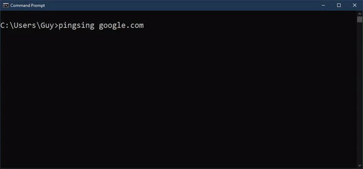

# pingsing
Audible ping and pong sound on successful ICMP echo request/response. Because we all know that's what we were missing. 😉

```

```


## Usage

*notice: must be run as root/Administrator to open raw socket to send ping packet.*

`pingsing <ip/hostname>`

## Install

`go get -u github.com/guywhataguy/pingsing/...`

### Enable non-root user operation  (*nix only)

1. change owner to root

   `chown root:root $GOPATH/bin/pingsing`

2. setuid bit on file

   `chmod u+s $GOPATH/bin/pingsing`

## Build

1. Embed resources

   `go-bindata resources/`

2. Build

   `go build`

## Development

### Done

- [x] embedded resource dependencies (single file install)
- [x] hostname resolution

### Future Development

- [ ] change audio library to support concurrent playback

  This will fix a bug that creates a high-pitched squeak on low RTTs when the "ping" and "pong" overlap, for example when pinging localhost

- [ ] diversify "ping" and "pong" sounds

  most easily implemented by creating a pool of each sound and randomly selecting one to play each time